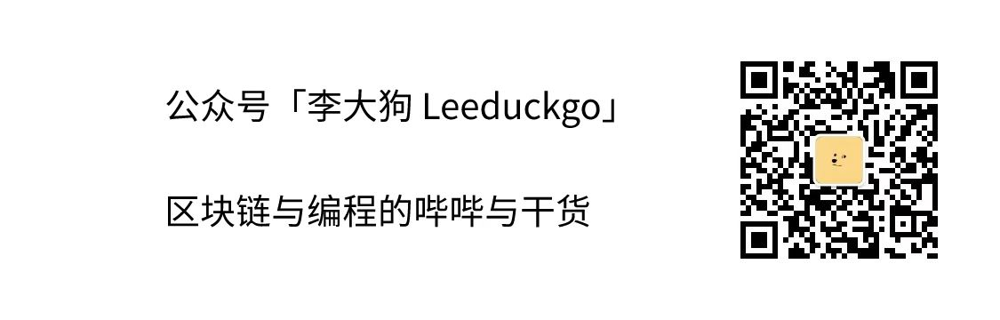

# 基于 JupyterLab 的联盟链极速入门指南

**—— 2020 不容错过的区块链课程**

**作者：李大狗**

**相关书籍：**
**[比特币极速入门指南](https://github.com/leeduckgo/bitcoin_elementary_course_based_on_jupyterlab)**

## 本书适合人群

- **区块链从业者**

  2020 年是许多区块链从业者的重大转型期。响应政策，顺势而为，去币向链 —— 联盟链学起来~

- **对区块链感兴趣的开发者**

  在这个新的趋势里试试水吧~

## 基本概念

- **区块链**
  区块链是集「多方分时控制的计算范式」与「不可篡改的分布式数据库」为一体的完整系统。
  
  > 区块链的本质是使冯诺依曼计算体系不再依赖特定的计算物理设施，从而使得其计算过程和相关的存储和通讯，不再为单方控制，而由各个参与者多方分时控制。这是一种全新的计算范式，区块链计算范式，所谓的不可篡改数据库，仅仅是这个内涵的一部分外延。共识算法，分布式网络是当前实现这一计算范式的重要技术手段。这些是区块链的技术本质。
  >
  > **——[《王嘉平：自证清白是区块链计算范式的根本优势》](https://www.chainnews.com/articles/212885581677.htm)**

- **联盟链**

  联盟链是一种需要许可才能成为节点的区块链，这种区块链也称为许可链（Permissioned Blockchain）。相较公有链，联盟链更适配于国家、政府机关、大型企业等权威主体。

## 目录

0 序言

1 区块链最简抽象模型

2 什么是「真正的」区块链应用？

---

**第一部分 BSN 篇**

3 BSN 区块链服务网络介绍

4 以「链上简历」为例的 BSN 应用实战

……

5 应用组件介绍

5.1 BSN-SDK

5.2 BSN-APP-Explorer

5.3 Auth 服务

---

**第二部分 FISCO BCOS 篇**

6 FISCO-BCOS 介绍

……

## 作者联系方式（加我进学习群）

作者微信二维码：

作者公众号：

